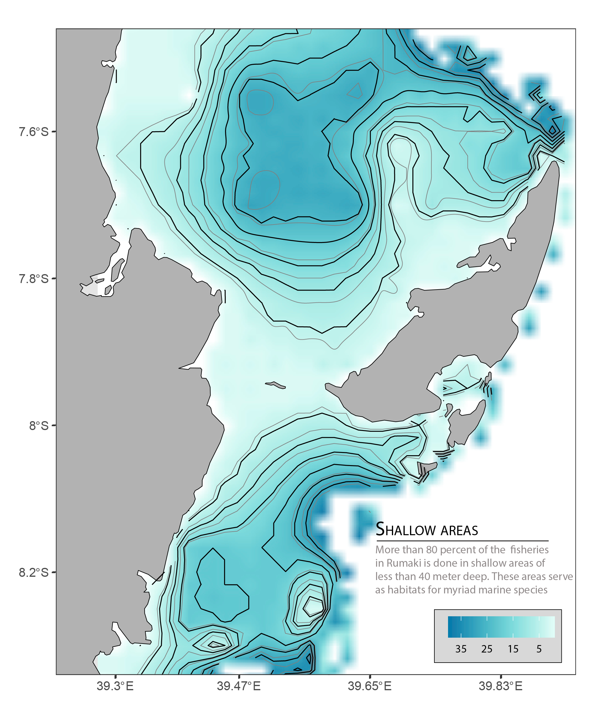

```{r setup, include=FALSE}
knitr::opts_chunk$set(echo = TRUE)
```


```{r}
setwd("E:/Data Manipulation/mafia_kilwa_octopus_mapping/")
```


## Data Sources, Processing and Analysis
```{r packages, comment="", message=FALSE, warning=FALSE}

# load Packages we need for data manipulation and analysis
require(sf)
require(ncdf4)
# require(R.matlab)
require(pracma)
# require(cowplot)
require(tidyverse)
require(ggsn)
require(insol)
# require(RColorBrewer)
require(lubridate)
require(forecast)
# require(ggpubr)
require(akima)
require(fields)
require(maptools)
require(marmap)
require(oce)
require(ggsci)
# require(mapview)
# require(mapedit)
require(tmap)

# # clear the worksapce
# clear()

```

```{r include=FALSE, warning=FALSE}
##read Africa continental shapefile that we will use throught the munuscript as basemap dataset for maps
africa = read_sf("E:/GIS/Tanzania spatial data Bank/EAF14 Tanzania spatial datasets/africa/Spatial/AdmInfr/afcntry.shp")

## clean the file
tz.ke = africa%>%select(-c(FIPS_CNTRY, REGIONA, EMPTY, EMPTY2))%>%
  filter(CNTRY_NAME == "Tanzania" | CNTRY_NAME == "Kenya")
```


```{r}
# read etopo 1 ascii file
etopo = read.asciigrid("E:/GIS/ROADMAP/Etopo 1/Tanzania_etopo1/tanz1_-3432.asc")
# convert the etopo file into tibble
etopo.df = as.data.frame(etopo)%>%as.tibble()

# tidy the data
etopo.df = etopo.df%>%
  rename(lon = s1,lat = s2, bathmetry = E..GIS.ROADMAP.Etopo.1.Tanzania_etopo1.tanz1_.3432.asc)%>%
  select(lon,lat, bathmetry)

# select the bathmetry value only within the pemba channel area of interest
bathmetry = etopo.df%>%filter(lon>=39 & lon <=41 & lat >=-11 & lat <= -7 & bathmetry <=0)

```

You can spot a difference between a map generated with chunk code without being polished (figure \@ref(fig:fig1)) and the polished one in adobe illustrator (Figure \@ref(fig:fig2))

```{r fig1, fig.cap="original map made with ggplot"}
ggplot() + 
  geom_raster(data = bathmetry %>% filter(bathmetry > -40 & bathmetry <5), 
              aes(x = lon, y = lat, fill = bathmetry), interpolate = TRUE)+
  geom_sf(data = tz.ke, fill = "grey70", col = 1)+
  coord_sf(ylim = c(-8.3,-7.5), xlim = c(39.25,39.9))+
  geom_contour(data = bathmetry %>% filter(bathmetry > -40 & bathmetry <5), 
              aes(x = lon, y = lat, z = bathmetry), breaks = seq(-40, 0, 4), col = "grey50")+
  geom_contour(data = bathmetry %>% filter(bathmetry > -40 & bathmetry <5), 
              aes(x = lon, y = lat, z = bathmetry), breaks = seq(-40, 0, 5), col = 1)+
  theme_bw()+
  theme(panel.background = element_rect(colour = 1, fill = "grey90"),
        panel.grid = element_line(colour = "grey70"),
        legend.direction = "horizontal",
        legend.position = c(.85,.06),
        legend.background = element_rect(colour = 1, fill = "grey85"),
        axis.text = element_text(size = 10, colour = "grey30"))+
  scale_fill_gradientn(colours = oceColorsGebco(120), name = "", 
                       breaks = seq(-35,-5,10),
                       label = seq(35,5,-10))+
  scale_x_continuous(breaks = seq(39.3,40, length.out = 5) %>% round(digits = 2))+
  labs(x = NULL, y = NULL)
  
# ggsave("fig 1.pdf")
# ggsave("fig 1.eps")

```

```{r fig2, fig.cap="Edited figure in illustrator"}


# cowplot::draw_image("fig 1.png")


```


```{r}
mapping = st_read("")
```

